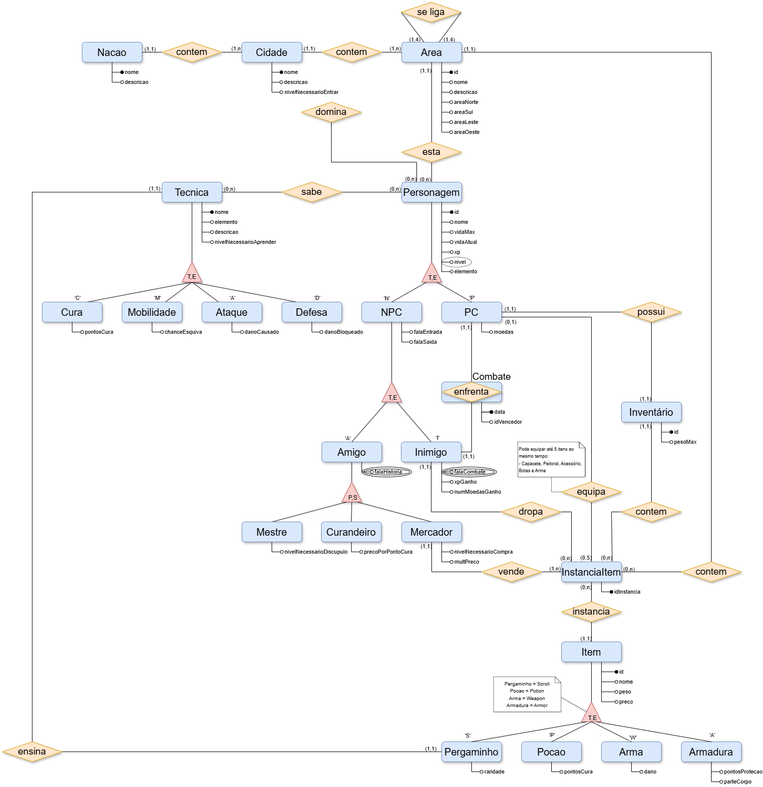

# Modelo Entidade Relacionamento

## Introdução

O Modelo Entidade Relacionamento (MER) é uma ferramenta utilizada para modelar dados em um sistema de banco de dados. O MER é composto por entidades, atributos e relacionamentos, que são representados graficamente, o que o torna uma ferramenta muito **fácil, intuitiva e expressiva** para entender a estrutura de um banco de dados e facilitar o desenvolvimento de sistemas de informação.

<!-- ## Entidades

## Relacionamentos -->

## Diagrama Entidade Relacionamento (DER)

## Histórico de versão

|    Data    | Versão | Descrição             | Autor                                                                                                                                                                                                    |
| :--------: | :----: | --------------------- | -------------------------------------------------------------------------------------------------------------------------------------------------------------------------------------------------------- |
| 18/11/2024 |  1.0   | Criação do DER        | [João Schmitz](https://github.com/JoaoSchmitz), [Luciano Freitas](https://github.com/luciano-freitas-melo), [Luciano Ricardo](https://github.com/l-ricardo), [Willian Silva](https://github.com/Wooo589) |
| 24/11/2024 |  1.1   | Criação documento MER | [Luciano Freitas](https://github.com/luciano-freitas-melo) |
| 07/01/2025 |  2.0   | Refatoração dos movimentos | [Luciano Ricardo](https://github.com/l-ricardo) |

<!-- 
Padrão Usuarios GitHub Histórico de Versões --- Não Apagar

[João Schmitz](https://github.com/JoaoSchmitz)
[Júlia Takaki](https://github.com/juliatakaki)
[Luciano Freitas](https://github.com/luciano-freitas-melo)
[Luciano Ricardo](https://github.com/l-ricardo)
[Willian Silva](https://github.com/Wooo589)
 -->