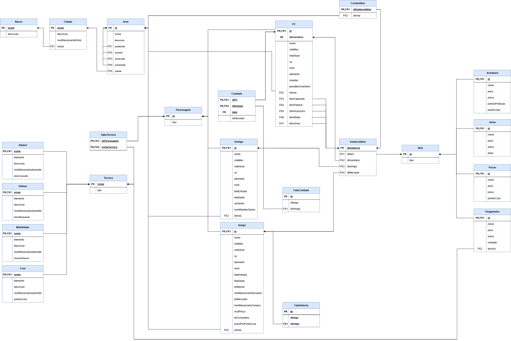

# Modelo Relacional

## Introdução

O Modelo Relacional é uma forma de representar os dados de um sistema de forma organizada e estruturada, com um nível de abstração menor que o [MER](../MER/v1.md). Ele é composto por tabelas, que são formadas por linhas e colunas, e relacionamentos entre essas tabelas. O Modelo Relacional é uma das formas mais comuns de representar dados em um banco de dados.

## Desenvolvimento

Mais detalhes sobre os atributos de cada tabela podem ser encontrados no [Dicionário de Dados](../DD/v1.md).

## Histórico de versão

|    Data    | Versão | Descrição                 | Autor                                                                                                       |
| :--------: | :----: | ------------------------- | ----------------------------------------------------------------------------------------------------------- |
| 24/11/2024 |  1.0   | Criação Modelo Relacional | [Luciano Freitas](https://github.com/luciano-freitas-melo), [Luciano Ricardo](https://github.com/l-ricardo) |
| 24/11/2024 |  1.1   | Criação documento do MR   | [Luciano Freitas](https://github.com/luciano-freitas-melo)                                                  |
| 25/11/2024 |  1.2   | Alteração leve no MR      | [João Schmitz](https://github.com/JoaoSchmitz) |
| 07/01/2025 |  2.0   | Refatoração dos movimentos      | [Luciano Ricardo](https://github.com/l-ricardo) |

<!-- 
Padrão Usuarios GitHub Histórico de Versões --- Não Apagar

[João Schmitz](https://github.com/JoaoSchmitz)
[Júlia Takaki](https://github.com/juliatakaki)
[Luciano Freitas](https://github.com/luciano-freitas-melo)
[Luciano Ricardo](https://github.com/l-ricardo)
[Willian Silva](https://github.com/Wooo589)
 -->